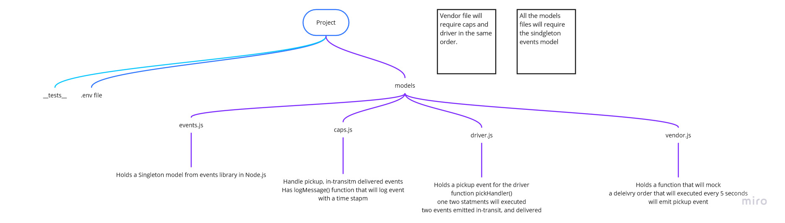
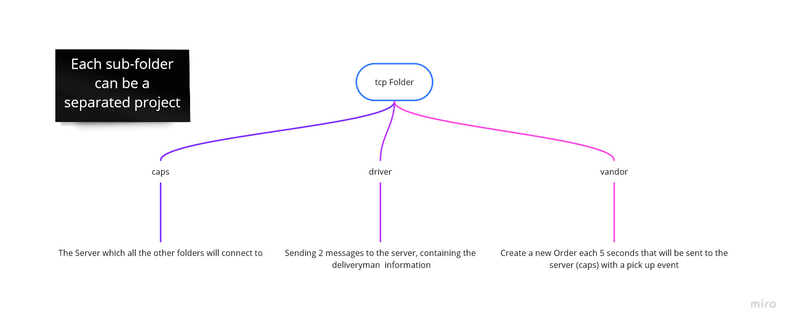

# caps

Begin the build of an application for a company called CAPS - The Code Academy Parcel Service.
CAPS will simulate a delivery service where vendors (such a flower shops) will ship products using our delivery service and when our drivers deliver them, be notified that their customers received what they purchased.

### used Dependencies

```cmd
npm i -D code-fellows/supergoose
npm i -D types/jest
npm i -D eslint
npm i -D jest
npm i dotenv
npm i uuid
npm i faker
```

## Phase 1

To Start the application just type in your cmd

```cmd
npm start
```

Branch name : events

setup a system of events and handlers,with the intent being to change out the eventing system as we go, but keeping the handlers themselves largely the same.

### UML Phase 1



---

## Phase 2

To Start the application just type in your cmd, on each folder in this order

- caps --> vendor --> driver

```cmd
npm start
```

Branch name : tcp

Separate all the previous files into folders to mock the effect of a server, main folder called tcp contains 3 sub-folders.

- cap --> is the server where the other folders connect to this file
- driver --> will sent if the package is picked-up or delivered
- Vendor --> When the package is delivered it will log a thank you message

### UML Phase 1


